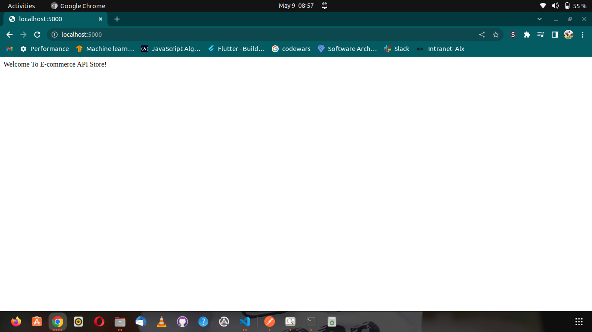
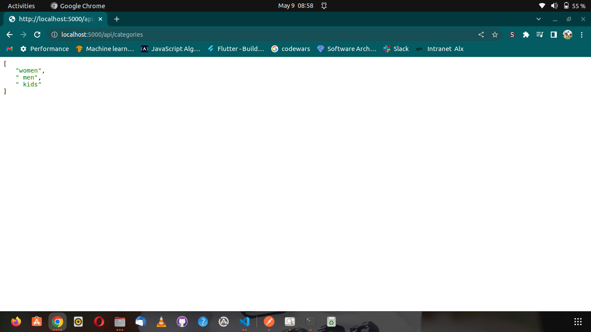
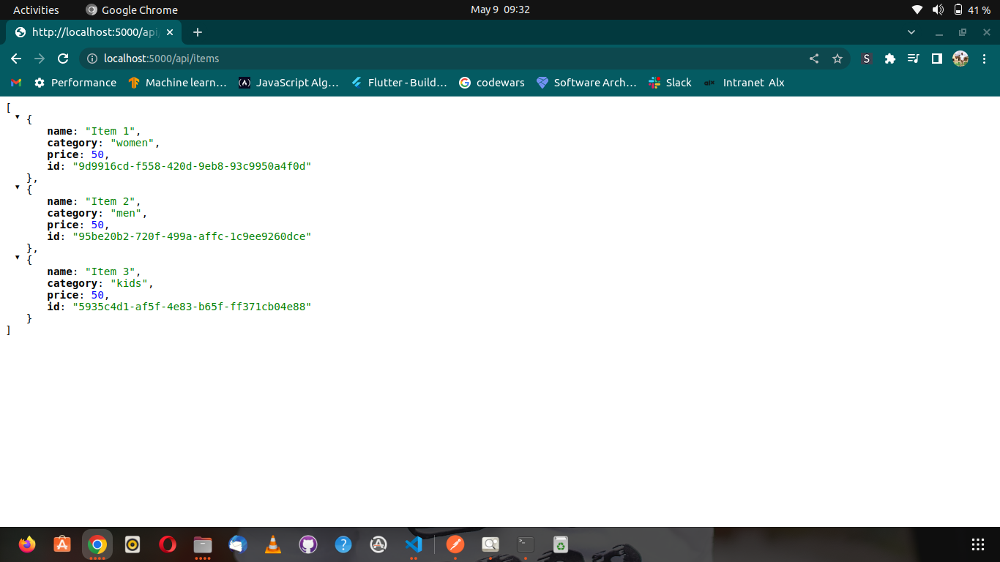
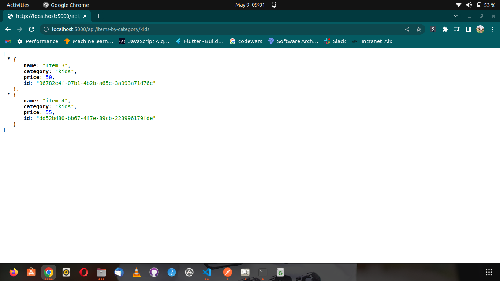
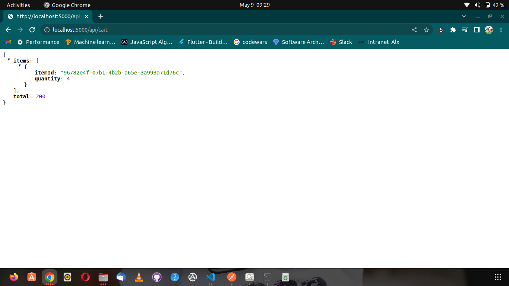

## Small Store E-Commerce API
This is a Simple rest API for managing a small E-commerce store. With this API, you can access various features of the store such as Products, filter products by category, shopping cart and payment Gateway.

  

### Available Endpoints

  

1. A list of categories of items i.e Women, Men and Kids:
	-  URL: /api/categories
	- Method: "GET"
	- Response: list of Categories

  

1.  A list of all available items 
	- URL: /api/items
	- Method: "GET"
	- - Response: list of items

  

1. A list of all items under a category
	- URL: /api/items-by-category
	- Method: "GET"
	- Response: List items under category

  

1. Manages the current cart and updates the cart
	- URL:/api/cart
	- Method: "POST"
	- Resonse: A cart contains selected items and total sum of items
**Updates**

  

	- URL:/api/cart-update
	- Method: "POST"
	- Response: updates the cart 
1. An endpoint that connects to a gateway and creates a payment session for the current cart
	- URL: /api/purchase
